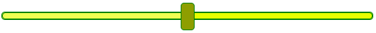

# Range Slider Customizer

NPM

```bash
npm i range-slider-customizer
```

```javascript
import range from 'range-slider-customizer'
```

UNPKG

```html
<script src="https://unpkg.com/range-slider-customizer">
```

# Usage

**range.create(selector?,option)**

# Examples

### Default Style


```javascript
range.create('.custom-slider')
```

### With Options


```javascript
range.create('.custom-slider2', {
  trackColor: '#008a25',
  progressColor: '#00d639',
  height: '10px',
  thumb: {
    background: '#01cb37',
    borderRadius: '0px',
    height: '20px',
    hover: {
      boxShadow: '0 0 0 10px #00d6396b',
    },
  },
})
```

<br />


```javascript
range.create('.custom-slider3', {
  progressColor: 'red',
  trackColor: 'green',
  border: '1px solid black',
  thumb: {
    background: 'yellow',
    border: '1px solid black',
  },
})
```

<br />


```javascript
range.create('.custom-slider4', {
  progressColor: '#ff8f8f',
  trackColor: 'red',
  thumb: {
    background: 'red',
    hover: {
      boxShadow: '0 0 0 20px #ff00006b',
    },
  },
})
```



```javascript
range.create('.custom-slider5', {
  progressColor: '#eeff52',
  trackColor: '#e6ff00',
  height: '10px',
  border: '1px solid green',
  thumb: {
    background: '#8e9e00',
    height: '40px',
    borderRadius: '5px',
    border: '1px solid green',
    hover: {
      boxShadow: '0 0 0 20px #eeff52c4',
    },
  },
})
```
